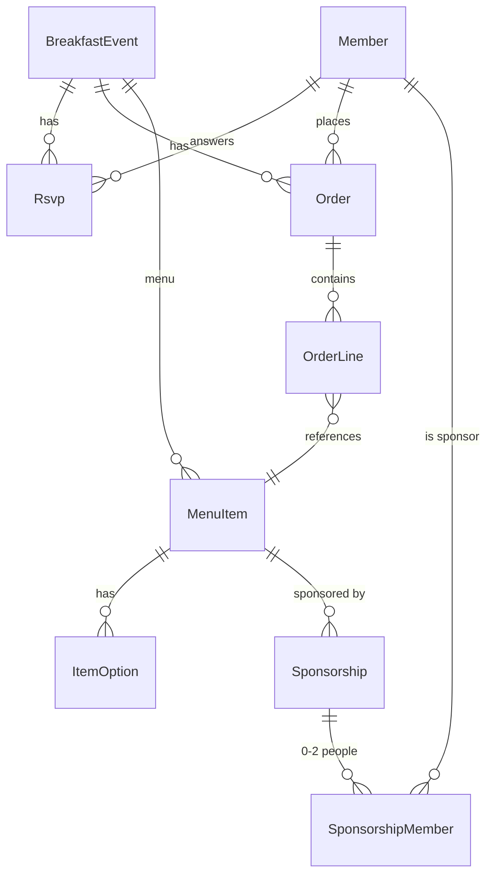

# Data Model

## Entity overview


## Prisma schema (starting point)
```prisma
enum Role { ORGANIZER MEMBER }
enum EventStatus { SCHEDULED ORDERING_OPEN ORDERING_CLOSED COMPLETED SKIPPED CANCELLED }
enum RsvpAnswer { YES NO }
enum OrderStatus { PLACED COOKING READY PICKED_UP CANCELLED }

model Member {
  id            String   @id @default(cuid())
  slackUserId   String?  @unique   // set for every Slack member; seed members use SEED_…
  name          String
  email         String?  @unique
  avatarUrl     String?
  role          Role     @default(MEMBER)
  createdAt     DateTime @default(now())
  rsvps         Rsvp[]
  orders        Order[]  @relation("OrderFor")
  ordersEntered Order[]  @relation("OrderEnteredBy")
  sponsorships  SponsorshipMember[]
  sponsorshipsCreated Sponsorship[] @relation("SponsorshipCreatedBy")
}

model BreakfastEvent {
  id               String      @id @default(cuid())
  date             DateTime    @unique @db.Date // the Thursday (calendar date in America/New_York)
  status           EventStatus @default(SCHEDULED)
  orderingEnabled  Boolean     @default(true)  // false = RSVP only (e.g. bagels)
  orderingOpenedAt DateTime?
  orderingClosedAt DateTime?
  orderingAutoClosed Boolean  @default(false) // closed by the midnight rollover (open-questions #34)
  rsvpDeadline     DateTime?               // default: Wednesday 5pm ET before
  skipReason       String?                 // e.g. "Thanksgiving"
  sponsorsNeeded   Int         @default(1) // set with −/+ on the Schedule; hides "Sponsor this" when filled
  notes            String?
  rsvps            Rsvp[]
  orders           Order[]
  menuItems        MenuItem[]
  reminderSentAt   DateTime?               // idempotency for the Tuesday post
  createdAt        DateTime    @default(now())
}

model MenuItem {
  id           String         @id @default(cuid())
  eventId      String
  event        BreakfastEvent @relation(fields: [eventId], references: [id], onDelete: Cascade)
  name         String
  description  String?
  category     String?
  orderable    Boolean        @default(true) // false = on the menu but not ordered individually
  sortOrder    Int            @default(0)
  options      ItemOption[]
  sponsorships Sponsorship[]
  orderLines   OrderLine[]
}

model ItemOption {
  id         String   @id @default(cuid())
  menuItemId String
  menuItem   MenuItem @relation(fields: [menuItemId], references: [id], onDelete: Cascade)
  group      String   // e.g. "Style"
  label      String   // e.g. "Scrambled"
  sortOrder  Int      @default(0)
}

model Sponsorship {
  id           String              @id @default(cuid())
  menuItemId   String
  menuItem     MenuItem            @relation(fields: [menuItemId], references: [id])
  teamName     String?             // e.g. "Delivery team"
  sponsorName  String?             // free-text name the organizer typed for a non-member
  members      SponsorshipMember[] // 0–2 people (0 only for an organizer-typed sponsorName; a team links the member who signed it up)
  amountCents  Int                 @default(3000)  // $30, copied from settings at creation
  paid         Boolean             @default(false)
  paidAt       DateTime?
  createdById  String
  createdBy    Member              @relation("SponsorshipCreatedBy", fields: [createdById], references: [id])
  createdAt    DateTime            @default(now())
}

model SponsorshipMember {
  sponsorshipId String
  sponsorship   Sponsorship @relation(fields: [sponsorshipId], references: [id], onDelete: Cascade)
  memberId      String
  member        Member      @relation(fields: [memberId], references: [id])
  @@id([sponsorshipId, memberId])
}

model Rsvp {
  id        String         @id @default(cuid())
  eventId   String
  event     BreakfastEvent @relation(fields: [eventId], references: [id])
  memberId  String
  member    Member         @relation(fields: [memberId], references: [id])
  answer    RsvpAnswer
  updatedAt DateTime       @updatedAt
  @@unique([eventId, memberId])
}

model Order {
  id          String         @id @default(cuid())
  eventId     String
  event       BreakfastEvent @relation(fields: [eventId], references: [id])
  memberId    String?        // null for guests
  member      Member?        @relation("OrderFor", fields: [memberId], references: [id])
  guestName   String?        // required when memberId is null, e.g. "Client – Acme"
  isWalkIn    Boolean        @default(false)
  enteredById String?        // organizer who entered it, if not self-placed
  enteredBy   Member?        @relation("OrderEnteredBy", fields: [enteredById], references: [id])
  status      OrderStatus    @default(PLACED)
  notes       String?
  lines       OrderLine[]
  placedAt    DateTime       @default(now())
  statusAt    DateTime       @default(now())
  @@unique([eventId, memberId]) // one order per member per event; guests unrestricted
}

model OrderLine {
  id              String   @id @default(cuid())
  orderId         String
  order           Order    @relation(fields: [orderId], references: [id], onDelete: Cascade)
  menuItemId      String
  menuItem        MenuItem @relation(fields: [menuItemId], references: [id])
  itemName        String   // snapshot
  quantity        Int      @default(1)
  selectedOptions Json     // [{ group: "Style", label: "Scrambled" }]
  notes           String?
}

model AppSettings {
  id                       Int     @id @default(1)
  breakfastWeekday         Int     @default(4)       // Thursday
  rsvpDeadlineWeekday      Int     @default(3)       // Wednesday
  rsvpDeadlineTime         String  @default("17:00") // America/New_York
  reminderWeekday          Int     @default(2)       // Tuesday
  reminderTime             String  @default("10:00") // America/New_York
  sponsorshipAmountCents   Int     @default(3000)    // $30
  slackChannelId           String?                   // #108state
  remindersEnabled         Boolean @default(true)
}
```

## Notes
- **Menu is per BreakfastEvent, and the design has exactly one MenuItem per Thursday** (set inline on the Schedule). The MenuItem table and ItemOption stay so more items and options can be added later without a migration; the MVP UI creates and edits one item per event.
- **Sponsorship** is exactly one of: 1–2 `members` (Just me / Me + someone), a `teamName` (A team; the member who signed the team up is also linked in `members`, so it's "theirs" on Home), or a `sponsorName` (organizer-typed, no members). The display name prefers `teamName`, then `sponsorName`, then the members' names. One sponsorship = one $30 payment, regardless of how many people are on it.
- New sponsorships are refused once an event's sponsorship count reaches `sponsorsNeeded`.
- `amountCents` is copied from settings when created, so changing the setting later doesn't change old sponsorships.
- **Guests:** `memberId = null`, `guestName` set. Validate that exactly one of the two is present.
- **Headcount** = count(Rsvp YES) + count(non-cancelled Orders where the person has no YES RSVP).
- Thursdays are topped up to 8 weeks ahead (see business-rules); the organizer can add more.
- `BreakfastEvent.date` is a `@db.Date` holding the Thursday's calendar date in New York (see `src/lib/thursdays.ts`).
- Seed members use fake Slack IDs (`SEED_…`) and exist only in the dev database.
