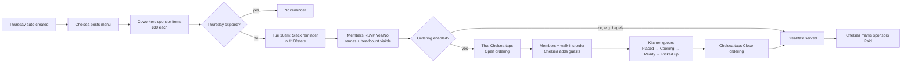

# User Flows & Screens

## Weekly rhythm

## Member flows
1. **First visit** — click Slack link → Sign in with Slack → Home.
2. **RSVP** — Home shows the next Thursday: date, "RSVP by Wed 5pm ET", headcount ("N coming so far · X RSVP yes, Y walk-in"), **I'm in / Not this week**, and the In / Out names.
3. **Sponsor a menu item** — Home → *Sponsor an item →* (or Schedule) → *Sponsor this* on a Thursday → choose **Just me**, **Me + someone** (pick a coworker), or **A team** (team name) → Confirm. Screen says: "You're on the menu. Please pay $30 to Chelsea."
4. **Check my sponsorships** — Home → *My sponsorships* shows each with *$30 due* or *Paid ✓*, and *Remove* while unpaid.
5. **Order** — when ordering is open, Home → *Your order* shows **Place your order** → pick items/options → notes → Submit. Works without a Yes RSVP (walk-in). When ordering is closed it says "Ordering opens when Chelsea starts it on Thursday morning."
6. **Track order** — status pill on Home updates live; the read-only kitchen queue shows the whole board.

## Organizer flows
1. **Thursdays** (`/admin/events`) — next 8 Thursdays; **Skip** / **Restore** each one; toggle *Ordering enabled*.
2. **Menu & sponsors on the Schedule** — on each Thursday card the organizer types the **menu item**, sets **sponsors needed** with −/+, and can **add a sponsor by name** (non-member) → *Add*.
3. **Payments** — all sponsorships (filter: **Unpaid** / **This week** / **All**) with columns Thursday, Item, Sponsor, Amount, **Paid** checkbox, *Remove*; **Collected** and **Outstanding** totals. Footer: "Payment status is visible only to you and the sponsors. It is never posted in Slack."
4. **Run the kitchen** — **Open ordering** → orders arrive in Placed → tap a card to advance (*← Back* to undo, *Cancel* on Placed) → **+ Walk-in** (member or guest name + item) → **Close ordering**.
5. **Settings** — sponsorship amount, RSVP deadline, reminder day/time, Slack channel, *Weekly reminders on*, *Send test reminder*, and a live **Slack preview** of the reminder.

## Screens
| Route | Who | Purpose |
|---|---|---|
Routes and nav labels come from the design (`design/Breakfast Club.dc.html`).

| Route | Nav label | Who | Purpose |
|---|---|---|---|
| `/signin` | Sign in | Everyone | "Pancakes. Friends. Thursday." + *Sign in with Slack* |
| `/` | Home | Member | This Thursday: RSVP, In/Out names, headcount, menu, your order, my sponsorships |
| `/schedule` | Schedule | Everyone | Upcoming Thursdays with menu item, sponsors, *Sponsor this*; organizer edits menu item, sponsors needed, adds sponsors by name |
| `/order/[eventId]` | Place order | Member | Build/edit order |
| `/kitchen/[id]` | Kitchen queue | Everyone | Live board; organizer also opens/closes ordering, advances orders, adds walk-ins/guests |
| `/admin/events` | Thursdays | Organizer | Skip/restore, ordering on/off |
| `/admin/payments` | Payments | Organizer | Sponsorships with Paid checkboxes, totals |
| `/guide` | App Guide (bottom of nav) | Everyone | How to use the app; organizer section only for Chelsea |
| `/admin/settings` | Settings | Organizer | Amount, deadline, Slack, reminders, Slack preview |
